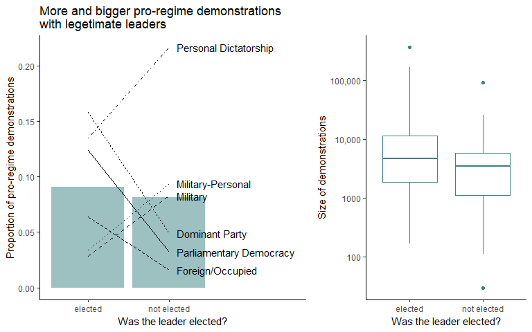

Are Public Demonstrations a Driving Force for Politics?
================
Shengpei Wang
May 14, 2019

# Is protesting useful?

Public demonstrations have a long history of driving political changes
around the globe, such as the Civil Rights Movement in the US, the
Indian Independence Movement in India, and The Defiance Campaign in
South Africa. The effects of demonstrations have been studied in detail
in some specific cases, such as the Tea Party movement in the US
(Madestam *et. al* 2011). However, whether demonstrations are generally
effective as a political force is still unclear.

A complicating factor affecting the effectiveness of demonstrations is
the political environment in which demonstrations happen. We may expect
that people are more inclined to attend public demonstrations in
democratic systems, because attending demonstrations might be seen as an
effective political action. Alternatively, demonstrations could be more
common in authoritarian regimes, because alternative political actions
may not be available or perceived to be effective, such as in the case
of the Arab Spring Uprising in Egypt. Given the increasing social
impacts of demonstrations through social media, it is more urgent than
ever to understand the prevalence and effectiveness of public
demonstrations in different political systems.

I propose to investigate the prevalence and effectiveness of
demonstrations by integrating information from two large public
datasets: The Rulers, Elections, and Irregular Governance Dataset
(REIGN; Bell 2016) and the Mass Mobilization in Autocracies Database
(MMAD; Weidmann *et. al* forthcoming). The REIGN data records the leader
and regime information from 201 countries between 1950-current, while
the MMAD data records incidents of political demonstrations in 76
countries between 2002 and 2015. By combining both data sources, I plan
to examine both the political environments and the political outcomes of
public demonstrations across the world,

I have four major questions/objectives of interest:

  - **What types of public demonstrations happen in democratic regime
    versus autocratic regimes?**
      - Are pro-regime demonstrations more or less common than
        anti-regime demonstrations?
      - Does the frequency of pro- vs anti-regime demonstration differ
        depending on the types of regimes?
  - **What types of public demonstrations have the largest impact on
    society?**
      - Which demonstrations do people attend?
      - Do elections change the size of demonstrations?
      - Are demonstration sizes or locations correlated with different
        election results?
      - Are demonstration sizes or locations correlated with changes in
        the leadership?
  - **Which is the cause: Do governments respond to demonstrations or do
    people demonstrate in response to governments?**
      - What kinds of demonstrations happen before an election or
        leadership change?
      - What kinds of demonstrations happen after an election or
        leadership change?
      - Are elections or leadership changes more likely to happen before
        or after demonstrations?
      - Are authoritarian leaders more likely to step down after
        demonstrations?
  - **Can we predict the political changes given the current political
    environment and the prevalence of demonstrations around the world?**
      - Build a machine learning algorithm that predicts whether
        elections or leadership changes will happen given the current
        government regimes and the type and amount of demonstrations.
      - Build a machine learning algorithm that predicts what kinds of
        demonstrations will happen given the political environment.

Answering these questions will help us understand roles of public
demonstrations in driving political changes. The results can help inform
citizens when making political decisions regarding activism. The
insights can further help policy makers understand, predict, and
possibly prepare for political trajectories of different countries
around the world.

# Methods

I will investigate these questions by joining the two datasets and
investigate the correlations among the different factors in each
question. There are two major ways I plan to structure the data. One way
is to examine the political environments and demonstrations that occur
during the same time period, and this will give us whether these factors
are correlated in different countries. An alternative way is to examine
the temporal order of events that represents political changes and
demonstrations, and I will data in this structure to untangle the causal
factors as well as to build the predicative models.

I will use a variety of statistical and machine learning approaches to
test alternative hypotheses and use different visualizions to
communicate the results. I will use xi-squared test and logistic
regression for many of the questions about correlations. I will use
linear mixed models and clustering analysis to build the predicative
models.

I plan to extend these analyses to include other important factors such
as the economic, social, and religious situations of each country over
time. These factors can affect both the political environment and
people’s willingness and desire to demonstrate. I have obtained data
from the Human Mortality Database that contains historical demographic
information of different countries. I have also obtained and the World
Religion Data that details the religious composition of each country
(Maoz and Henderson 2013). Integration of these additional data sources
will allow me to obtain a more holistic view of the drivers of political
changes around the world.

# Data Sources and description:

Both datasets are publicly available on their websites:

  - REIGN: <https://oefresearch.org/datasets/reign>
  - MMAD: <https://mmadatabase.org/>

The REIGN dataset. I downloaded the most recent full dataset from their
archive.

This is a fairly complicated dataset, and I will be focusing on only
some of the variables for the preliminary exploration. Each row records
the leader and political environment of a single month in each country.

  - “ccode” is the country code based on the The Correlates of War
    Project
  - “country” is the name of the country
  - “leader” is the name of the leader during the recorded time
  - “elected” represents whether the leader is elected to office (1) or
    not (0).
  - “tenure\_months” is the length of the tenure of the leader for the
    month of record
  - “government” is the type of political regime of the country at the
    month of record.

<!-- end list -->

    ## # A tibble: 6 x 6
    ##   ccode country leader elected tenure_months government            
    ##   <dbl> <chr>   <chr>    <dbl>         <dbl> <chr>                 
    ## 1     2 USA     Truman       1            58 Presidential Democracy
    ## 2     2 USA     Truman       1            59 Presidential Democracy
    ## 3     2 USA     Truman       1            60 Presidential Democracy
    ## 4     2 USA     Truman       1            61 Presidential Democracy
    ## 5     2 USA     Truman       1            62 Presidential Democracy
    ## 6     2 USA     Truman       1            63 Presidential Democracy

Look at the MMAD dataset. I obtained the data describing the incidents
of each recorded event.

  - “cowcode” is the unique country code also based on the The
    Correlates of War Project.
  - “asciiname” is the city where the demonstration happened.
  - “event\_date” is the date when the demonstration happened.
  - “side” represents whether the demonstration is pro-regime (0),
    anti-regime (1) or domestic public/non-government (3). Domestic
    demonstrations are rare and does not affect my questions, so I will
    removed them for my analyses.
  - “mean\_avg\_numparticipants” represent the best estimate of the size
    of the demonstrations.

<!-- end list -->

    ## # A tibble: 6 x 5
    ##   cowcode asciiname        event_date  side mean_avg_numparticipants
    ##     <dbl> <chr>            <date>     <dbl>                    <dbl>
    ## 1      40 Vertientes       2003-05-11     0                      NA 
    ## 2      40 Velasco          2011-11-24     1                      NA 
    ## 3      40 Santiago de Cuba 2003-05-01     0                      NA 
    ## 4      40 Santiago de Cuba 2003-12-07     0                    2000 
    ## 5      40 Santiago de Cuba 2004-06-14     0                      NA 
    ## 6      40 Santiago de Cuba 2007-12-04     1                     217.

# Popularity of mass demonstrations

## Demonstrations are in the news all the time, but how common are they across the world?

I examined the prevalence of demonstrations by tallying the number of
months when demonstrations did or did not happen for each country during
2003-2015. I further sectioned the data by the type of regime, because
it could be a major driving factor for whether people decide to
participate in public demonstrations.

Which countries had proportionally the most months with demonstrations?

``` r
head(data_REIGN_0315_wide %>% 
  arrange(prop_non) %>% 
  ungroup() %>% 
  select(country, government, n_month_pro = pro, n_month_anti = anti, n_month_non = non, proportion_non = prop_non))
```

    ## # A tibble: 6 x 6
    ##   country  government   n_month_pro n_month_anti n_month_non proportion_non
    ##   <chr>    <fct>              <int>        <int>       <int>          <dbl>
    ## 1 Nepal    Monarchy               6           42           1         0.0233
    ## 2 China    Dominant Pa~          22          154           4         0.0253
    ## 3 Iran     Dominant Pa~          60          139          17         0.108 
    ## 4 Pakistan Military-Pe~          12           59           9         0.132 
    ## 5 Haiti    Personal Di~          10           12           2         0.143 
    ## 6 Egypt    Party-Perso~          12           81          17         0.173

I notice that all of the top six countries with the most months with
demonstrations are under some sort of autocratic rule. Is this pattern
broadly true?

<!-- -->

Generally, demonstrations were much more frequent in all of the
autocracies than the two democratic regimes. This shows that people
chose to use demonstration as a political tool more often in
autocracies.

I used an ANOVA to test whether there were more demonstrations in
different regimes:

``` r
summary(fit_pro_non_month)
```

    ##              Df Sum Sq Mean Sq F value Pr(>F)   
    ## government   13   28.9  2.2234   2.634 0.0033 **
    ## Residuals   102   86.1  0.8441                  
    ## ---
    ## Signif. codes:  0 '***' 0.001 '**' 0.01 '*' 0.05 '.' 0.1 ' ' 1
    ## 2 observations deleted due to missingness

The effect of different regime is very significant, but were people
actually happier with their government in democratic systems than
autocratic systems? This pattern could be driven by more pro-regime
demonstrations in autocratic systems. I further explored the prevalence
of demonstrations that were pro-regime vs anti-regime across different
regimes.

<!-- -->

Most demonstrations turn out to be anti-regime regardless of the types
of regimes. Additionally, pro-regime demonstrations tended to happen
concurrently with anti-regime demonstrations. This makes sense that
there is no political need to express one’s support for a regime unless
it is challenged.

## Do patterns of demonstration depend on the legitimacy of a leader?

The previous section shows that people were happier with democratic
regimes. Was this driven by the fact that the leaders were elected? I
investigated this question by looking at both numbers and sizes of
demonstrations with legitimate vs illegitimate leaders. I quantified the
legitimacy of leaders as whether they were elected to office.

<!-- -->

There were more anti-regime demonstrations when a leader was not elected
to office. Demonstrations against illegitimate leaders were also better
attended. Even though the majority of demonstrations are anti-regime,
the legitimacy of the leaders did matter. Does the same pattern hold for
pro-regime demonstrations?

<!-- -->

Concordant with the previous findings, illegitimate leaders were less
supported by pro-regime demonstrations, which were also less popular
compared to with legitimate leaders. These results demonstrate that
greater prevalence of demonstrations in autocratic systems was indeed
partially correlated with the legitimacy of the leaders.

I formally tested factors contributing to the size of demonstration
using a linear mixed model.

``` r
summary(summary(fit_size_elected_raw))
```

    ## Linear mixed model fit by REML ['lmerMod']
    ## Formula: mean_avg_numparticipants ~ elected * dem_type + government +  
    ##     (1 | country)
    ##    Data: data_MMAD_REIGN
    ## 
    ## REML criterion at convergence: 295614.2
    ## 
    ## Scaled residuals: 
    ##    Min     1Q Median     3Q    Max 
    ## -0.972 -0.108 -0.025  0.022 42.128 
    ## 
    ## Random effects:
    ##  Groups   Name        Variance  Std.Dev.
    ##  country  (Intercept) 9.357e+07  9673   
    ##  Residual             4.873e+09 69810   
    ## Number of obs: 11767, groups:  country, 75
    ## 
    ## Fixed effects:
    ##                                          Estimate Std. Error t value
    ## (Intercept)                               31717.7     5871.5   5.402
    ## electednot elected                       -21565.2     5588.6  -3.859
    ## dem_typeAnti-regime                      -29601.4     2338.2 -12.660
    ## governmentParliamentary Democracy          5643.7     8167.6   0.691
    ## governmentDominant Party                   6147.6     6769.3   0.908
    ## governmentForeign/Occupied                -1884.1     9439.5  -0.200
    ## governmentMilitary                         2712.1     8437.1   0.321
    ## governmentMilitary-Personal                -865.4     7707.5  -0.112
    ## governmentPersonal Dictatorship             674.3     6019.1   0.112
    ## governmentParty-Personal                  22688.9     8939.9   2.538
    ## governmentMonarchy                        -1317.7     7640.0  -0.172
    ## governmentParty-Military                   2046.7     9762.4   0.210
    ## governmentParty-Personal-Military Hybrid   6165.6     6598.5   0.934
    ## governmentProvisional - Civilian           -266.2     9571.0  -0.028
    ## governmentProvisional - Military           9356.3     8221.2   1.138
    ## governmentWarlordism                      -3570.1    13401.5  -0.266
    ## electednot elected:dem_typeAnti-regime    24041.6     5245.8   4.583

The model confirms the previous findings that less people attend
pro\_regime demonstrations under illegitimate leaders (negative
coefficient for elected), and that the pattern is reversed for
anti-regime demonstrations (negative coefficent for dem\_type but
positive interaction term). Using model comparison, these effects are
highly significant (Chi-sq = 161.02, df = 3, p \< 2.2e-16).

One interesting outlier was the party-personal regime, where there were
more pro-regime demonstrations than all other regimes and that
illegitimate leaders enjoyed greater support through demonstrations. I
explored this pattern further by look into each country
separately.

<!-- -->

## Do demonstrations drive regime change or happen in response to regime change?

In the previous sections, I found that demonstration was a popular
political tool to protest against illegitimate leaders or autocratic
regimes. But were demonstrations effective at driving political changes?
One way to answer this question is to look at the timing of events, did
demonstrations happen before or after a leader took office.
<!-- -->

Each point in the figure above represents one public demonstration. Even
though the prevalence of demonstration differed amongst regime types,
more demonstrations tended to happen later in a leader’s tenure, thus
before rather than after leadership changes.

## Predicative modeling

The historical patterns discovered above will inform the predicative
modeling. In the previous section, the results show that the regime
types and time during a leader’s tenure really matter for when
demonstrations happen. I will use this information to start exploring
simple predicative models.

I first explored whether having all of the above information gives a
good predicative model:

``` r
fit_before_or_after_all = 
  glm(dem_n ~ dem_type + time_before_after + time_from_leader_abs + time_of_tenure +
      government + country, 
      family = quasipoisson(link = "log"), data = data_REIGN_0315_analysis)
calc_r_squared_glm(fit_before_or_after_all)
```

    ## [1] 0.8326806

The r-squared is very high (83.3%).

However, I want this model to be less specific. Since the dataset
doesn’t contain all countries, and I would like the model to be useful
for countries not in the dataset as well. How will model performace
change if I remove country as a predictative factor.

``` r
fit_before_or_after_all_reduced = 
  glm(dem_n ~ dem_type + time_before_after + time_from_leader_abs + government, 
      family = quasipoisson(link = "log"), data = data_REIGN_0315_analysis)
calc_r_squared_glm(fit_before_or_after_all_reduced)
```

    ## [1] 0.755249

This is still a pretty good model (r-sq = 75.5%)

## Bibliography

Madestam, A., Shoag, D., Veuger, S. and Yanagizawa-Drott, D., 2013. Do
political protests matter? evidence from the tea party movement. The
Quarterly Journal of Economics, 128(4), pp.1633-1685.

Bell, Curtis. 2016. The Rulers, Elections, and Irregular Governance
Dataset (REIGN). Broomfield, CO: OEF Research. Available at
oefresearch.org

Weidmann, Nils B. and Espen Geelmuyden Rød. The Internet and Political
Protest in Autocracies. Chapter 4. Oxford University Press, forthcoming.
